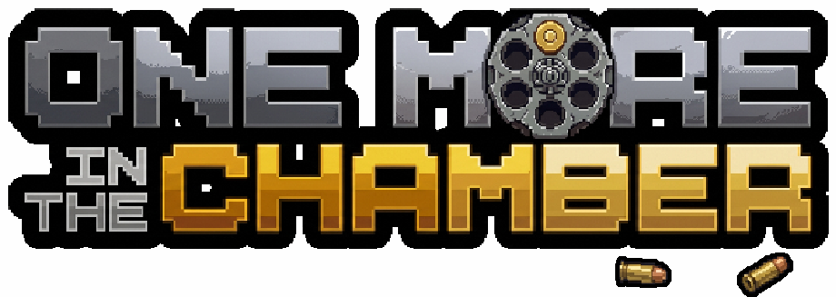

<p align="center">
  <a href="https://craigrusselltiu.github.io/one-more-in-the-chamber/">
    
  </a>
</p>

<h1 align="center">One More In The Chamber</h1>

<p align="center">
  <strong>A roguelike match-3 shootout set in a spaghetti western world.</strong>
</p>

<p align="center">
  <a href="https://craigrusselltiu.github.io/one-more-in-the-chamber/"><strong>Play Now</strong></a>
  ·
  <a href="CHANGELOG.md">Changelog</a>
</p>

One More In The Chamber is a run-based puzzle battler where every match is a choice between survival, damage, setup, and greed. Swap tiles to shoot, block, heal, poison, charge abilities, and scrape together enough gold to survive the next fork in the trail.

Each run pushes you through three acts of outlaws, monsters, merchants, campfires, treasures, events, elites, and bosses. New tile types and artifacts make your build stronger, but every reward also changes the shape of the board you have to manage.

One more tile. One more chamber. One more chance.

## How To Play

Swap adjacent tiles to make matches of three or more. Every tile type has a combat effect: bullets deal damage, shields block, hearts heal, coins fund upgrades, and special tiles can poison, ricochet, explode, or reshape the board.

After each encounter, choose your path through the map. Shops, campfires, treasures, events, elites, and bosses all compete for your attention, and every detour changes the run you are building.

## What You Do

- Match tiles to generate attacks, defense, healing, gold, status effects, and special board clears.
- Route through a branching map of fights, shops, events, treasure rooms, campfires, elites, and bosses.
- Pick artifacts and consumables that stack into trait-based synergies.
- Add and upgrade tiles between fights, balancing power against board dilution.
- Build around character abilities, exclusive core tiles, and different risk profiles.
- Chase reputation, ledger discoveries, cosmetics, and leaderboard scores across runs.

## Characters

The current alpha includes two playable characters:

- **Rust** - a red panda gunslinger built around Bounty and Deadeye.
- **Reno** - a gambler whose Chip tile and Shuffle the Deck ability reward risky board control.

Additional character slots are already present for future unlocks.

## Game Systems

- **Combat:** Phaser-powered 8x8 match-3 board with cascades, special tiles, explosions, shadows, hazards, status effects, and enemy intents.
- **Runs:** seeded maps and rewards, with combat randomness left responsive to player choices.
- **Progression:** local reputation, cosmetics, discoveries, score history, and optional account sync.
- **Persistence:** IndexedDB saves for active runs, combat snapshots, scores, and meta progression.
- **Leaderboards:** Supabase-backed scoreboards when online services are configured.

## Development

```bash
npm install
npm run dev
```

Useful scripts:

```bash
npm run build
npm run preview
```

Supabase is optional for local play. Without `VITE_SUPABASE_URL` and `VITE_SUPABASE_ANON_KEY`, the game runs offline with local saves and no remote sync or leaderboard fetches.

## Tech Stack

- Phaser 3 for the game canvas, combat board, scenes, animation, and audio.
- React + TypeScript for menus, HUD, overlays, run screens, and app state.
- Zustand stores bridged to Phaser through an event bus.
- IndexedDB for local run, score, meta, and combat snapshot persistence.
- Supabase for auth, sync, and leaderboards.
- Vite for development and production builds.

## Project Layout

```text
src/App.tsx                 React screen flow and Phaser scene orchestration
src/game/                   Phaser config, scenes, board, combat, and entities
src/ui/                     React HUD, overlays, components, and screens
src/store/                  Run, combat, meta, and tutorial state
src/data/                   Tiles, artifacts, enemies, tutorials, and content data
src/services/               Local saves, Supabase sync, auth, and leaderboards
public/assets/              Pixel art, audio, backgrounds, effects, and spritesheets
```
